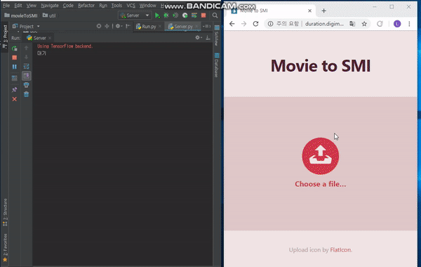
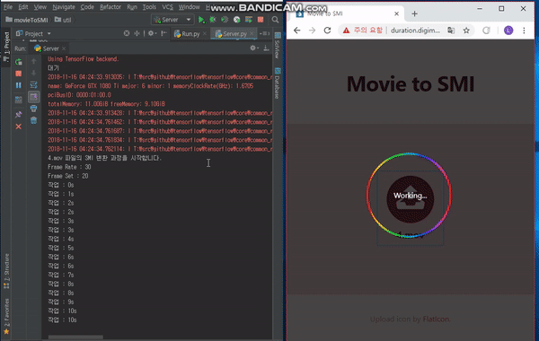
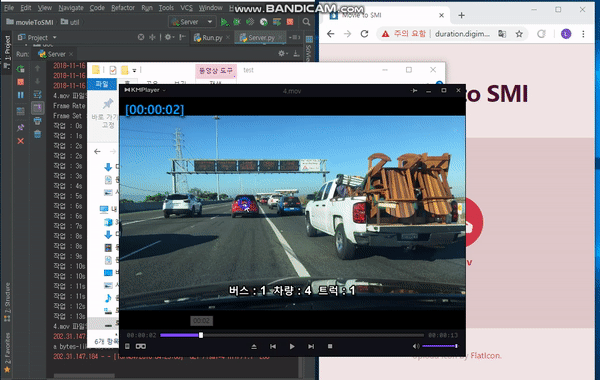

# VideoToSMI-Server
Create a smi file in Web based on the video
- Copyright (c) 2019 [InfoLab](http://infolab.kunsan.ac.kr) ([Donggun LEE](http://duration.digimoon.net))
- How to install
    - requirement
        ```bash
        # python 3.6 -- tensorflow or tensorflow-gpu
        pip install tensorflow-gpu==1.9.0 exifread>=2.1.2 piexif>=1.1.2 pillow>=6.0.0 matplotlib>=3.1.0 scikit-image>=0.15.0 IPython>=7.5.0 keras>=2.2.4 cython>=0.29.7 deepgeo VideoToSMI ConfigHelper
        ```
    - install
        ```bash
        pip install VideoToSMI-Server
        ```
    - other version
        ```bash
        # 0.0.3
        pip install VideoToSMI-Server==0.0.3
        # 0.0.4
        pip install VideoToSMI-Server==0.0.4
        ```
    
- How to use
    ```python
    from VideoToSMIServer import Server, ServerConfig

    config = ServerConfig()
    config.MODEL_NAME = "mscoco"
    config.IP = "127.0.0.1"
    config.PORT=80
    config.MODEL_CONFIG_PATH = "D:/test/config.json"
    config.MODEL_ENGINE = "maskrcnn"
    config.FILTER = ['truck','car','bus']
    config.VIDEO_FOLDER = "D:/test/videotosmi/"
    server = Server(config)
    server.Run()

    # POST VIDEO FILE -> http://127.0.0.1:80/ -> Reulst SMI FILE
    ```
 - [How to Test](https://github.com/Sotaneum/VideoToSMI-Website)

- Preview

    
    
    
